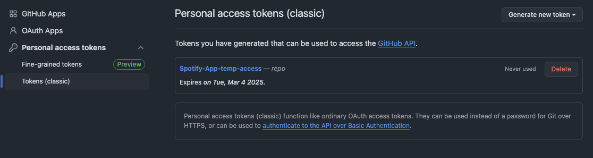
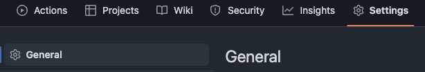
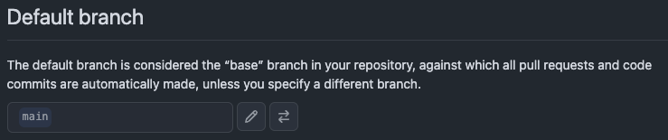
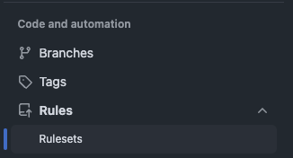
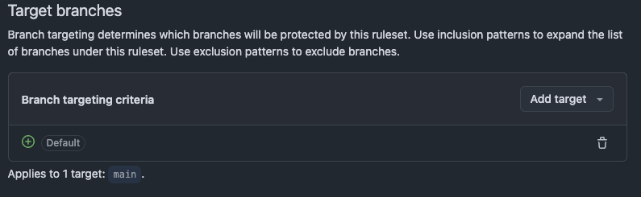
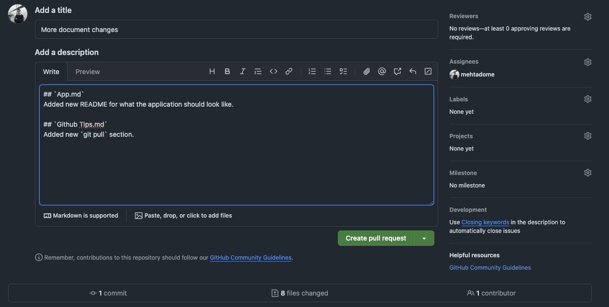
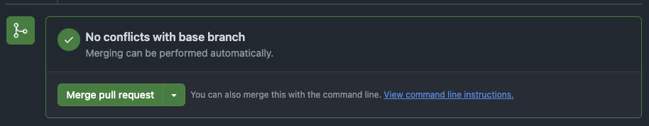
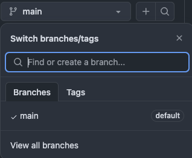
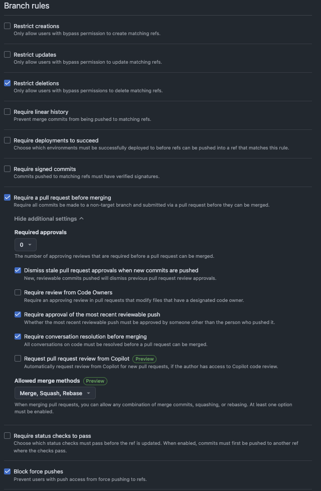

# Github Tips

I have created this document in hopes to explain away much of the Github and DevOps confusions I have faced through many years of my career.

Consider adding the [Github extension](https://code.visualstudio.com/docs/sourcecontrol/github) to VSCode to automatically authenticate you to Github.

## Repository Creation

To create your own repository, while in your root folder (mine is `./Spotify\ App/`), run:

```
git init
git add *
git add .gitignore
git commit -m "Initialize Spotify App Repo"
```

Next, you will need to go on the [browser](https://github.com/) or Desktop App and [create a new repository](https://docs.github.com/en/repositories/creating-and-managing-repositories/creating-a-new-repository). Copy the **HTTPS** link it provides you.

```
git remote add origin https://github.com/<rest of link>.git
git branch -M main
git push https://github.com/<rest of link>.git
```

- The final command should prompt an SSO.

You may need to give yourself access first. To do this, go to:

- Click Profile Icon --> Settings --> Developer Settings (bottom of left navbar) --> Create Personal Access Token (classic).
- Select "repo" and save the token somewhere.

It should look something like this afterwards:


## Basic Git Commands

Order of additions: `add` to [_"tracking"_](https://stackoverflow.com/questions/4693588/what-is-a-tracking-branch), `commit` to pipeline, `push` to repository.

Prepare a single file for committing to repository.

```
git add <file_name>
```

**OR**

Prepare all files for committing to repository.

```
git add *
```

Commit to pipeline.

```
git commit -m "Message"
```

- `-m` and a personalized message is typically required.

Push to repository.

```
git push --set-upstream origin main
```

### Other Helpful Ones

Check file changes made on your branch.

```
git status
```

Check what branch you're on.

```
git branch
```

- Typically highlights yours in the color green.

_"Pull"_ in recent changes.

```
git pull
```

## Git Pull

I highly recommend you follow the section below and setup _rulesets_ before coming here.

`git pull` is the standard way to update your local repository with changes to your online repository.

If someone made changes to the `Default`, there are chances for _merge conflicts_ to arise. This is when your changes conflict with someone else's conflicts.

- Read more [here](https://docs.github.com/en/pull-requests/collaborating-with-pull-requests/addressing-merge-conflicts/resolving-a-merge-conflict-using-the-command-line).

### Depends on Branch

Running `git pull` in a custom branch is different than main.

If you **chose to** automatically delete branches, it's good practices to delete your current one and start anew.

```
git checkout main
git pull
git branch -d branch_name
git checkout -b new_branch_name
```

- `-D` would force delete (including any untracked changes).

Should you have **chosen not to** automatically delete branches upon PR merge, you should run the following. This updates your local branch with the recent `main` changes.

```
git pull origin <remote-branch-name>
```

- `origin` is standard identifier for main.

# Modern DevOps Practices (_for Github_)

Have you ever wondered how to integrate standard [DevOps](https://about.gitlab.com/topics/devops/) practices with Github?

- Current standards.
- Restricting pushes to main.
- Unauthorized forced pushes.
- Requiring code reviews.

Configuring _Identity Access Management (IAM)_, Automation, and other settings will help you understand a large scope under the big picture.

## Branches

In corporate, your _Default_ branch is always 100% protected. Production [(_"prod"_)](https://codebots.com/app-development/what-are-environments-in-software-development-a-guide-to-the-development-beta-and-production-environments#:~:text=Production%20is%20the%20final%20environment,is%20not%20necessarily%20the%20case.) depends on its stability.

Start learning to never code directly on _Default_ (`main` in this case). You will use branches to simultaneously develop separate changes at once.

Start by:

```
git branch test_branch
git checkout test_branch
git branch
```

- `git branch` will now show two branches, test_branch and main.

When you are ready to submit your edits to production, you will `add`, `commit`, `push`. However, without configuring IAM policies, you run the risk of pushing security vulnerabilities or code bugs to prod.

### Best Practice

Use your initials as the prefix. It will make it easier to identify who created what.

```
git checkout -b rm_more_doc_updates
```

### What happens if you accidentally coded in `main`?

Not to fear, I have done this a lot. You can make a new branch **before** adding your changes and they will flock to your new branch.

```
git checkout -b new_feature_updates
```

If you have added or committed changes, simply reset the tracked additions.

```
git reset
git checkout -b new_feature_updates
```

- `git reset --hard` will also reverse the code changes you made so use it wisely.

## Enforce Rules

In most cases, a DevOps engineer will set this up this for your company. I find it important to at least understand how this is configured.

> If you ever start personal projects, this is a great way to uphold modern standards.

[IAM](https://www.microsoft.com/en-us/security/business/security-101/what-is-identity-access-management-iam?ef_id=_k_CjwKCAiAlPu9BhAjEiwA5NDSA1OXT0mxysD7ImJsMX_XxXGrDaX-bc-ybxG6Oo5yoxa2hqwG6wlHvBoCb7UQAvD_BwE_k_&OCID=AIDcmmdamuj0pc_SEM__k_CjwKCAiAlPu9BhAjEiwA5NDSA1OXT0mxysD7ImJsMX_XxXGrDaX-bc-ybxG6Oo5yoxa2hqwG6wlHvBoCb7UQAvD_BwE_k_&gad_source=1&gclid=CjwKCAiAlPu9BhAjEiwA5NDSA1OXT0mxysD7ImJsMX_XxXGrDaX-bc-ybxG6Oo5yoxa2hqwG6wlHvBoCb7UQAvD_BwE) policies, helpfully defined by Microsoft.

Navigate to your Github repository and click "Settings".

## General Settings

Here, you'll find a lot of standard settings for the repository.



First, ensure what you prefer to be your _prod_ branch is your `Default` branch (typically set to _main_).



For now, under **Pull Requests**, select everything, we'll come back to this when discussing what they are.

- Under 'Allow merge commits', I choose the 'default commit message' to be the 'Pull Request title'.

## Rulesets

Rulesets enforce permission scopes for other collaborators and/or specific branches. This is the main location for protecting your _prod_ branch.



Create a ruleset called _"Protect Main"_.

- Have to manually **Enable** it in dropdown.
- "Add target" --> "Include default branch"



- "Restrict deletions" and "Block force pushes" will automatically be selected.
- Also, select "Require a pull request before merging".

**"Additional Settings"** under Require Pull Requests:

- If developing by yourself, choose approvals to be 0. If with other team members, 1 shall suffice.
- If you want to ensure recent changes are approved, select "Dismiss stale...".
- If you want to ensure any conversations about your code are resolved, select "Require conversation...".

With these changes, you will given a url after you `push`. This generates something called a _pull request_ to get your code in production.

These configurations allow you / the team to track the changes you have made to production.

### What's a Pull Request?

A [_Pull Request_](https://docs.github.com/en/pull-requests/collaborating-with-pull-requests/proposing-changes-to-your-work-with-pull-requests/about-pull-requests) is a code review which requires other collaborators (or yourself) to view and approve the changes you are trying to push to prod.

This forces other collaborators (coworkers, project peers) to review your changes and can prevent you from pushing potentially harmful changes.

When **working alone**, I recommend you mimic this functionality by "approving" your own Pull Requests.

- The steps above would have ensured you can merge your own PRs.

#### PR Example



- Most PR's support Markdown. Highly recommend becoming familiar with its [basics](https://www.markdownguide.org/basic-syntax/).

Finally, merge:



### General Settings Applied

**"Allow merge commits"**: The way Git makes your changes to prod is by _merging_ your branch with `Default`.

- You can also manually [merge](https://www.geeksforgeeks.org/git-merge/) separately created branches together.

<br>

**"Allow squash merging"**: This allows you to merge all your commits into one before pushing.

- ie, `commit_1` _"change 1"_, `commit_2` _"change 2"_ => `commit_1&2` _"changes 1 & 2"_.

<br>

[**"Allow rebase merging (HyperLink)"**](https://www.atlassian.com/git/tutorials/merging-vs-rebasing)

<br>

**"Automatically delete head branches"**: After a pull request is merged, the branch that was the source of the pull request is automatically deleted from remote repository.

> Note: This won't delete your local branch.

- `remote` is the standard identifier for you online repository ([https://github.com/\*]()).
- Great for preventing clutter and maintaining readability in tracking.

Other branches would show up here. I have been on many teams which don't automatically delete leading to hundreds of unused branches showing up in remote.

- Keep in mind you can restore a deleted branch should you choose to.



[**Back to Git Pull**](./Github%20Tips.md/#git-pull)

# Appendix

[Helpful solution for disabling approvals.](https://github.com/orgs/community/discussions/74977)

How your ruleset should look for solo developing to mimic best DevOps practices.


